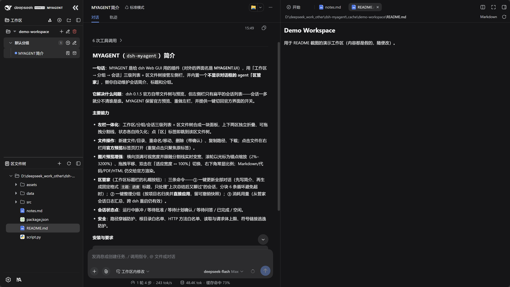
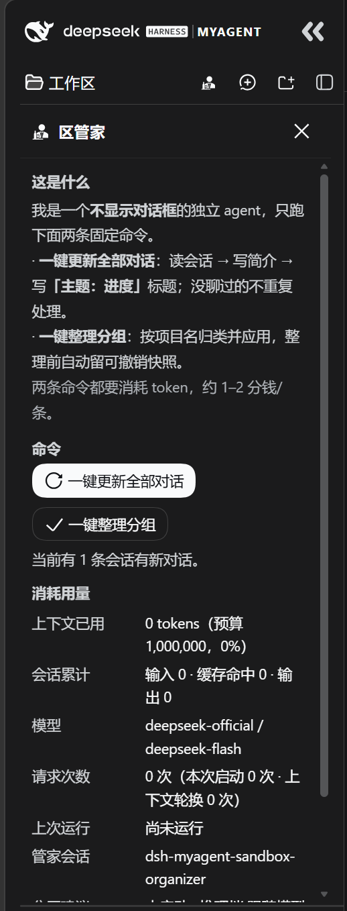
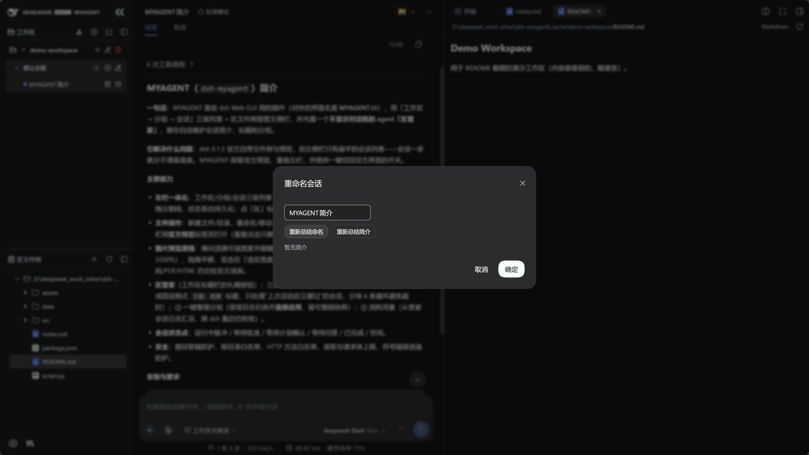

# DSH-MYAGENT (`dsh-myagent`)

[](https://github.com/qydhlhz/dsh-myagent/actions/workflows/ci.yml)


[简体中文](README.md) | **English**

> **MYAGENT.UI** — a better workspace and file-tree system for dsh.
> **Butler** — a dialog-free agent that maintains the three-level workspace list in one click.

Since dsh 0.2 the official build ships its own file tree and preview. This project **keeps the
official preview** and takes over the left sidebar: it merges the three-level list
(**workspace → group → session**) and the workspace file tree into one left-side panel, plus a
**one-key toggle between MYAGENT mode and the standard mode** to restore the official UI at any time.
It also ships **Butler**, an agent with no chat window of its own: it reads your
conversations and maintains your workspace groups, titles and briefs for you.

Version numbers track dsh (this release **v0.2.0** ↔ dsh `0.2.0-rc`, covering both the desktop app
and `dsh web`); dsh 0.2 tightened the plugin contract, so older plugin builds are
rejected and **upgrading is required**.

A dual-half bundle (host `lib/index.js` + browser `lib/client.js`) with zero third-party runtime
dependencies; `lib/` is committed — install and go:

```sh
# Web (dsh web)
dsh plugin --profile web add github:qydhlhz/dsh-myagent#v0.2.0    # restart dsh afterwards

# Desktop app (DeepSeek Harness; its profile is named `desktop`)
"D:\DSH\resources\runtime\cli\bin\dsh.cmd" plugin --profile desktop add github:qydhlhz/dsh-myagent#v0.2.0
```

> **Desktop install**: the desktop app bundles its own dsh runtime, and its profile is always
> `desktop` (`%DSH_HOME%\profiles\desktop`). Run the command above with
> `resources\runtime\cli\bin\dsh.cmd` from the install directory (it hands the command to the
> app's own runtime), or install from the GUI's sidebar **Plugins** page. **Fully quit and reopen
> the app afterwards** — bundle layers do not hot-reload.

## Screenshots



| Butler (an agent with no chat window of its own) | Renaming a session: re-summarize title / brief |
|---|---|
|  |  |

## Features

- Workspace file tree (expand/collapse directories, icons coloured by file type, drag to reorder sessions)
- Opening a file: click a file in the left tree → the official preview tab in the right pane (clicking the same file again just focuses the existing tab)
- **The official right-pane file tree is hidden in MYAGENT mode** (all file browsing moves to the left pane); the official **file preview is completely unaffected** — switching back to standard mode restores the official file tree
- **Image preview**: opens fit-to-width and **follows the right-pane splitter live while you drag it**; the wheel zooms anchored at the cursor (2%–3200%), left-drag pans, double-click toggles between fit-width ↔ 100%, `+` / `-` / `0` / `1` are the keyboard equivalents, and the current zoom is always shown in the corner. Only image extensions are taken over — Markdown / code / PDF / HTML / plain text are still rendered entirely by the official previewer
- **Clicking a workspace tab jumps the file tree to that workspace** (every click jumps; switching sessions returns to "follow the session")
- File operations: new file/directory, rename/move, delete (with a confirmation dialog), copy path, download
- Workspace / session sidebar: session switching, per-session state dots (running pulse / waiting for approval / waiting for plan confirmation / waiting for an answer / done / idle)
- Chat grouping inside a workspace: named groups, a default group, create/rename/delete/reorder, move a chat by drag or from a menu;
  **every group header has a "New chat (in the selected group)" button to the left of "Rename group", and clicking it creates the chat inside that group**
- **Butler** (the top-hat button in a workspace title bar) = an **independent agent with no chat window
  of its own** that only runs two fixed-prompt commands. The panel itself has just three blocks:
  *what this is*, *the two commands*, *usage*.
  1. **Update all conversations**: read each session in turn → write a brief → then write a
     **fixed-format `topic: progress`** title from that brief (e.g. `meta-analysis: literature
     screening done`). Only sessions that were touched since the last summary are processed (the host
     decides with the session-persistence markers `sz:` / `ev:`); untouched ones are never redone.
     The client loops in **chunks of 6** and shows progress, so even hundreds of sessions never hit a
     single-request timeout; when it finishes you get
     `checked / updated / unchanged / skipped` + `model / local fallback` + elapsed time + expandable details.
  2. **Organize groups**: groups sessions by project name and **applies the result directly** (no
     row-by-row confirmation any more), reports counts (created groups · moved sessions · renamed ·
     deleted · annotation updates) and keeps an **undoable snapshot**, so an "Undo this organization"
     button appears on the panel.
  3. **Usage**: context used (with the percentage of the 40k budget), cumulative Butler-session
     tokens (input / cache hits / output), model, request count, context rotations, last run time,
     Butler session id, session log size. All of these are aggregated from the **Butler session log**,
     so they survive dsh restarts (they are not in-memory counters that reset to zero).
- **The "Re-summarize title / Re-summarize brief" buttons** share their source with Butler: both go by
  **the session's own content** (first message = goal, last = current stage), both do "brief first,
  then title", and titles always follow `topic: progress`.
  The only difference between the two buttons is the entry point — the returned fields differ anyway.
  When no model is available a local fallback uses the session's first and last messages
  (the title degrades to `topic: in progress` and **never invents progress**).

- The upper and lower panes collapse independently, the splitter is draggable, and each pane persists its own state
- Standard mode ↔ MYAGENT mode one-key toggle (MA logo)
- **The top-left logo block shows the MYAGENT wordmark** (MYAGENT mode only): both the official whale mark and the DeepSeek Harness wordmark stay — the wordmark yields to 16px and a "separator + MYAGENT" is added to its right. Sizes are derived from the host sidebar's legal width range (264–420px) and it **fits across the whole range without ever disappearing**; switching back to standard mode restores the official look
- Security: path-traversal protection (`safeJoin`), root allow-list (workspaceRegistry dynamic resolution ∪ `allowedRoots` ∪ the dsh launch directory), HTTP method allow-list, read size cap (512 KB text preview), request body cap (1 MB), symlink escape protection

## Requirements

- dsh `0.2.0-rc` (covers both the desktop app and `dsh web`). This plugin is written against the
  0.2 contract: slots use the "declared ledger + `slots.inject`" model; session navigation goes
  through `uiWorkspace.openSession`; session state is read from `useSessionStatus`.
  **0.1.5-rc and older are no longer supported.**
- Build & test: Node.js ≥ 22.13 (tests run TypeScript directly) + npm
- Installing from the repo needs no build: the `lib/` artifacts are committed
- `npm run smoke` must find the local dsh's `@deepseek-ai/dsh-app-boot`; point at it with an env var if it does not:
  `DSH_APP_BOOT=/path/to/@deepseek-ai/dsh-app-boot/lib/index.js npm run smoke`

### 0.2 migration notes (why older builds must upgrade)

| Change | 0.1.5 | 0.2 |
|---|---|---|
| Browser-half runtime package | `@deepseek-ai/dsh-client-runtime` | Removed; split into `dsh-client-modules` / `dsh-client-store` / `dsh-client-ui-renderer` |
| Current session | `current` field on the `useSessions()` snapshot | Removed; derive it the official way from `byId[*].retainedBy.mainView` |
| Session navigation | `ctx.sessions.open(id)` | The Session Controller no longer navigates; use `ctx.uiWorkspace.openSession(id)` |
| Waiting-for-user / unread-done | Global hook `useSessionPendingInteraction` | Removed; use `useSessionStatus` (`SessionStatus = { running, pendingInteraction, completionUnread }`) |
| Icon components | `IconXxx16` / `IconXxx14` (named by size) | `IconXxxRegular` / `IconXxxMedium` (named by stroke weight; size comes from the `size` prop) |
| `Modal` | `closeLabel` optional | `closeLabel` **required** (accessible close-button label) |
| cordis | `^4.0.1` | `~4.0.4` |

> ⚠️ **The official CSS-module class hashes are not stable across builds, so this plugin's footer
> CSS no longer hardcodes any of them.** The official sidebar class names are CSS Modules hashes
> whose prefix comes from the **build machine's absolute source path** — so the very same
> `0.2.0-rc.2` differs between the npm packages and the desktop app's bundled copy
> (`hHd-Xa_*` / `VOzbGW_*` vs `_2H3hWW_*` / `wCInkW_*`; the CSS itself is byte-identical apart from
> the hashes). `src/client/settings-compact.ts` therefore uses class-name **substring selectors**
> such as `[class*="footArea"]`, which match either set, and `test/settings-compact.test.ts` locks
> in "never write a hash prefix back". Separately, on the Windows desktop the official build has
> `[data-windows-titlebar] …_collapsed …_footArea{display:none}` (the collapsed column is 0px
> wide) and this plugin **deliberately does not reclaim** `display` — do not add `!important` there.
>
> ⚠️ **The desktop's official account plugin occupies `settings.launcher`, which switches the
> footer to a different layout.** Once `dsh-client-ui-settings-account` (desktop only) takes
> `settings.launcher`, the official code stops rendering `settings.trigger` and the seat becomes a
> **full-width** "avatar + user name" row. Squashing that row into a 32x32 absolutely positioned
> box makes it overlap the MA mode key (fixed in v0.2.1). Every seat rule is therefore split into
> two opposite groups by this plugin's **own marker** `data-fm-settings-trigger` (rendered by
> `IconOnlySettingsTrigger`):
>
> | Who owns the seat | Selector | Footer layout |
> |---|---|---|
> | this plugin's single-icon trigger (Web / no account plugin) | `[class*="footArea"]:has([data-fm-settings-trigger])` | 32x32 settings key on the left, MA on the same row at the right |
> | the official account launcher (desktop) | `[class*="footArea"]:not(:has([data-fm-settings-trigger]))` | merged into **one row**, **right-aligned**: `[MA] [avatar name]` |
>
> The discriminator is our **own attribute**, never a guess at an official hash; any other
> occupant of `settings.launcher` also falls into the second (single right-aligned row) layout.
> Without `:has()` support neither group applies, falling back to the official layout.

## Install

```sh
# Web (dsh web) — from the GitHub source, recommended: pin a release tag
dsh plugin --profile web add github:qydhlhz/dsh-myagent#v0.2.0

# Desktop app — install into the `desktop` profile with the app's bundled CLI
"D:\DSH\resources\runtime\cli\bin\dsh.cmd" plugin --profile desktop add github:qydhlhz/dsh-myagent#v0.2.0

# Or a local source directory (development)
dsh plugin --profile web add ./dsh-myagent
```

On success `dsh.profile.bundles` gains a `dsh-myagent` entry automatically. **Restart dsh / fully
reopen the desktop app** for the bundle layer to take effect (bundles are not hot-reloaded).

Verify:

```sh
# Web:
dsh --profile web --dump-config   # should contain "# == dsh-myagent" and the plugin entry

# Desktop app: the `desktop` profile is owned exclusively by the app, so the CLI refuses
# --dump-config ("profile \"desktop\" is managed exclusively by the Electron application").
# Use the installer subcommand to check the installed version instead:
"D:\DSH\resources\runtime\cli\bin\dsh.cmd" plugin --profile desktop list
#   → dsh-myagent@0.2.1
```

After the restart you will see `dsh-myagent` under Settings → Plugins, and the sidebar shows the
workspaces / workspace-file-tree panes.

## Configuration

The plugin entry can be overridden (replaced wholesale) in the profile's `cordis.patch.yml`:

```yaml
- id: myagent
  name: 'dsh-myagent'
  config:
    # extra allow-list entries; empty by default = only "registered workspace roots" + the dsh launch directory
    allowedRoots: []
    # interpreter paths used when running code (auto-detected by default)
    pythonPath: 'python'          # or 'C:\Python312\python.exe'
    rscriptPath: 'C:\Program Files\R\R-4.6.0\bin\Rscript.exe'
    nodePath: 'node'
    timeoutMs: 15000              # per-run timeout (ms)
```

## Build and test from source

```sh
npm ci            # install strictly from the lockfile
npm run check     # tsc --noEmit + node --test (all unit cases)
npm run build     # tsdown (host half lib/index.js) + esbuild (browser half lib/client.js)
npm run smoke     # bundle contract + patch composition smoke test
```

Tests run out of the box on Node ≥ 24 (they run TypeScript directly via Node's built-in type
stripping; on Node 22.x add `--experimental-strip-types` yourself). CI
(`.github/workflows/ci.yml`) runs type-check, tests and build, and uses
`git diff --exit-code -- lib` to catch "source changed but the committed artifacts were not
rebuilt". See [`CONTRIBUTING.md`](CONTRIBUTING.md) if you want to send a patch.

The `lib/` build artifacts are committed, so installing needs no build step. **Zero third-party
runtime dependencies on the consumer side**: the host half has no external dependencies; the browser
half only uses `react`, `react-dom` and `@deepseek-ai/dsh-client-ui-primitives` from the host web
app's module table.

> ⚠️ **After changing source you must restart `dsh web` — refreshing the browser is not enough.**
> The host serves every plugin's client half merged into a single `/plugins/??…&rev=<hash>` response,
> and that artifact is **read into memory when the process starts** (the `rev` follows the plugin
> manifest, not the artifact contents). Measured with `.cache/freshness3.mjs` +
> `.cache/served-markers.mjs` — append a marker to `lib/client.js` on a running instance, then
> `fetch(..., {cache:"no-store"})`: the server kept returning the pre-append copy and only picked the
> marker up **after a process restart**. So "client-half changes only need a page refresh" is wrong —
> after `npm run build` you must restart `dsh web`.

Tests come in two layers: `test/*.ts` covers the host half and pure functions;
`test/client-bundle.test.ts` loads the **built `lib/client.js`** directly, runs `apply()` against a
slot-registry stub that reproduces dsh's declared-ledger contract (locking in that plugin load no
longer throws `slot ... is not declared`), and server-renders the sidebar component to confirm the
workspaces / workspace-file-tree panes really render.

## Directory layout

```
dsh-myagent/
├── cordis.patch.yml    # bundle patch: inserts one entry id=myagent / name=dsh-myagent
├── package.json        # dsh.bundle.patch + dsh.client (dual-half manifest)
├── lib/                # build artifacts (index.js host / client.js browser / index.d.ts)
├── src/                # sources (src/index.ts host; src/client/ browser half)
├── scripts/            # build-client.mjs (esbuild client bundle)
├── test/               # node:test unit tests
└── smoke.mjs           # smoke script (bundle contract + patch composition)
```

## License

MIT
